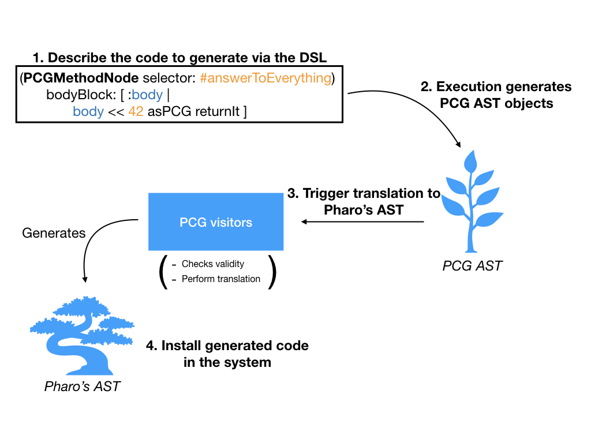

# PharoCodeGenerator
[](https://travis-ci.org/juliendelplanque/PharoCodeGenerator)
[](LICENSE)
[](https://pharo.org/download)
[](https://pharo.org/download)
[](https://pharo.org/download)

A toolkit to generate Pharo code.

## Install

```st
Metacello new
	repository: 'github://juliendelplanque/PharoCodeGenerator/src';
	baseline: 'PharoCodeGenerator';
	load
```

## How it works



## DSL Examples
This section contains method from the system and the PCG code to generate them.

### Generating Object>>#yourself

The following source code taken `Object>>#yourself` method:

```st
yourself
  ^self
```

can be generated via the dsl:

```st
(PCGMethodNode selector: #yourself)
	bodyBlock: [ :body | body << #self asPCGNode returnIt ];
	protocol: #accessing;
	yourself
```

### Generating Collection>>#collect:

The following source code taken `Collection>>#collect:` method:

```st
collect: aBlock
  | newCollection |
  newCollection := self species new.
  self do: [:each |  newCollection add: (aBlock value: each) ].
  ^newCollection
```

can be generated via the dsl:

```st
(PCGMethodNode selector: #collect: arguments: {#aBlock asPCGArgument})
	bodyBlock: [ :body | 
		body
			<<
				(#newCollection asPCGTemporary
					assign: ((#self asPCGNode receiveMessage: #species) receiveMessage: #new)).
		body
			<<
				(#self asPCGNode
					receiveMessage: #do:
					with:
						((PCGBlockNode arguments: {#each asPCGArgument})
							bodyBlock: [ :body1 | 
								body1
									<<
										(#newCollection asPCGTemporary
											receiveMessage: #add:
											with:
												(#aBlock asPCGArgument
													receiveMessage: #value:
													with: #each asPCGArgument)) ])).
		body << #newCollection asPCGTemporary returnIt ];
	protocol: #enumerating;
	yourself
```

### Generating Integer>>#&

The following source code taken `Integer>>#&` method:

```st
& aNumber
  ^self bitAnd: aNumber
```

can be generated via the dsl:

```st
(PCGMethodNode selector: #& arguments: {#aNumber asPCGArgument})
	bodyBlock: [ :body | 
		body
			<<
				(#self asPCGNode receiveMessage: #bitAnd: with: #aNumber asPCGArgument)
					returnIt ];
	protocol: #'bit manipulation';
	yourself
```

### Generating True>>#ifTrue:ifFalse:

The following source code taken `True>>#ifTrue:ifFalse:` method:

```st
ifTrue: trueAlternativeBlock ifFalse: falseAlternativeBlock
  ^trueAlternativeBlock value
```

can be generated via the dsl:

```st
(PCGMethodNode
	selector: #ifTrue:ifFalse:
	arguments:
	{#trueAlternativeBlock asPCGArgument.
#falseAlternativeBlock asPCGArgument})
	bodyBlock: [ :body | 
		body
			<< (#trueAlternativeBlock asPCGArgument receiveMessage: #value) returnIt ];
	protocol: #controlling;
	yourself
```

